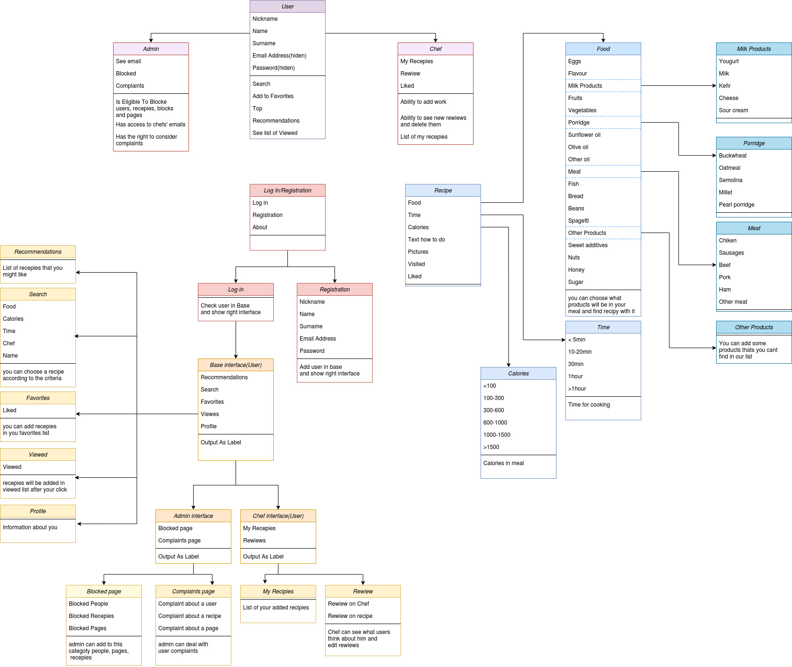

## Проект *«Декстопное приложение для кулинарных рецептов»*
*Шевцова Дарья 153501*

____

### Класс ` User `:

*Поля:*
- Никнейм
- Имя
- Фамилия
- Email
- Пароль

*Доступные функции:*
- Поиск по всей базе рецептов
- Добавление в список избранных рецептов и шеф-поваров
- Просмотр топов и рекомендаций
- Просмотр списка посещенных рецептов

____

### Класс `Chef`:

*Поля:*
- Мои рецепты
- Просмотры
- Лайки
- +поля User

*Доступные функции:*
- Возможность добавлять работы
- Просмотр новых отзывов и удаление их
- Лист рецептов шефа
- +функции User

____

### Класс `Admin`:

*Поля:*
- Просмотр ВСЕХ email
- Бокировка
- Жалобы
- +поля User

*Доступные функции:*
- Возможность блокировать работы, пользователей, блоки приложения
- Просмотр email поваров 
- Рассмотрение и решение жалоб
- +функции User

____

### Класс `Recipe`:

*Поля:*
- Еда(список всех продуктов из блок-схемы)
- Время(разделение в блок схеме)
- Калории(разделение в блок схеме)
- Текст как готовить
- Картинки
- Просмотры
- Лайки

:bomb: Более детальное рассмотрение полей внутри рассмотрено на блок-схеме

____

### Класс `LogIn`:

*Поля:*
- Никнейм
- Пароль
- Информация

*Доступные функции:*
- Проверка существует ли такой пользователь и перенаправлние его на нужный интерфейс
- Если пользователь не найден, то регистрация

____

### Класс `Registration`:

*Поля:*
- Никнейм
- Имя
- Фамилия
- Email
- Пароль
- Информация
- Повар/Пользователь

*Доступные функции:*
- Добавление пользователя в базу и перевод на нужный интерфейс

____

### Базовый `интерфейс User`:

*Поля:*
- Рекомендации
- Поиск
- Просмотренные
- Понравившиеся
- Профиль

:bomb: Более детальное рассмотрение полей внутри рассмотрено на блок-схеме

*Функции:*
- Поиск по всей базе рецептов
- Добавление в список избранных рецептов и шеф-поваров
- Просмотр топов и рекомендаций
- Просмотр списка посещенных рецептов

____

### `Интерфейс User`:

*Поля:*
- Все поля User
- Обо мне

*Функции:*
- Добавление информации о себе для других пользователей

____

### `Интерфейс Admin`:

*Поля:*
- Блокированное
- Жалобы
- +поля Интерфейса User

:bomb: Более детальное рассмотрение полей внутри рассмотрено на блок-схеме

*Функции:*
- Рассмотр жалоб и возможность ответить человеку на нее
- Блокировка и разблокировка полей
- +функции Интерфейса User

____

### `Интерфейс Chef`:

*Поля:*
- Мои рецепты
- Отзывы
- +поля Интерфейса User

:bomb: Более детальное рассмотрение полей внутри рассмотрено на блок-схеме

*Функции:*
- Рассмотр отзывов и удаление
- Доступ к списку персональных работ
- + функции Интерфейса User

____
## Диаграмма классов

:green_heart: Good Luck! :green_heart:

